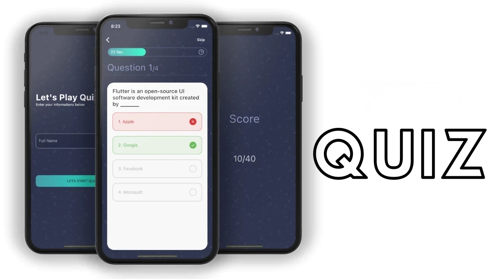

# 🎯 Quiz App – Flutter

An interactive and modern **Quiz Application** built using **Flutter**.  
The app allows users to answer multiple-choice questions, track their score, and view the final results in a clean and friendly UI.

---

## 📱 Screenshots

  

## 🚀 Features

- Display quiz questions one by one
- Multiple-choice answers
- Shows correct/wrong answers
- Score calculation
- Result screen
- Restart quiz option
- Smooth UI transitions
- Simple and scalable project structure

## 🧩 Tech Stack

| Technology | Usage |
|-----------|--------|
| **Flutter** | UI development |
| **Dart** | App logic |
| **GetX / Provider / setState** | State management |
| **JSON or API** | Questions source |

👨‍💻 Developer

Balsam serhan ||
Flutter Developer

GitHub: https://github.com/balsamsrhan

LinkedIn: https://www.linkedin.com/in/balsam-serhan/

Email: serhanbalsam54@gmail.com
